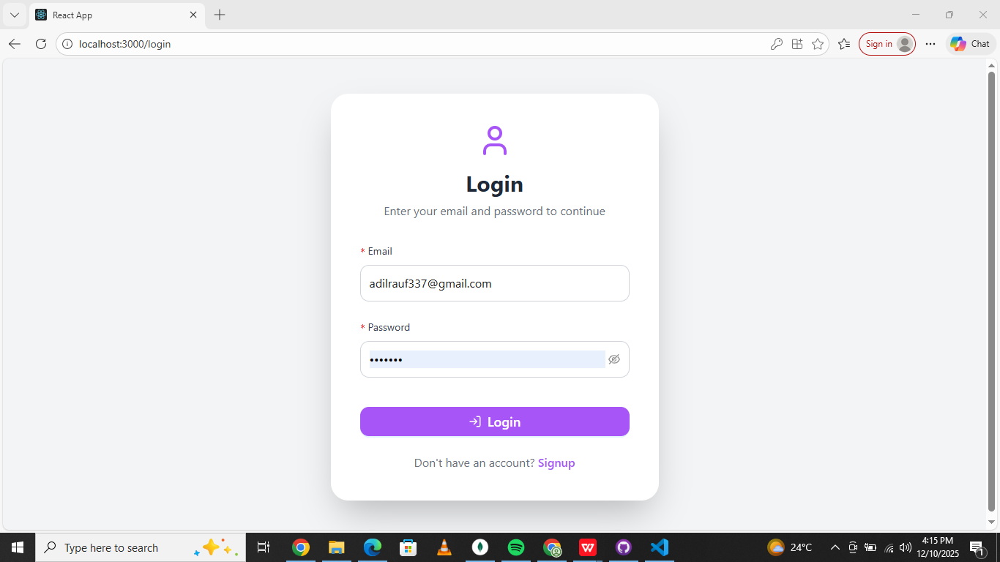
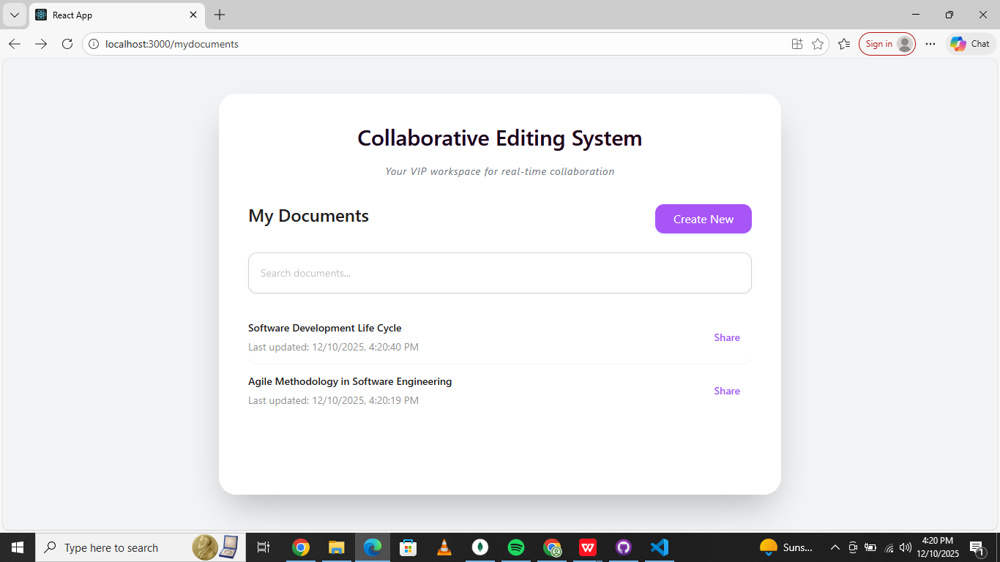
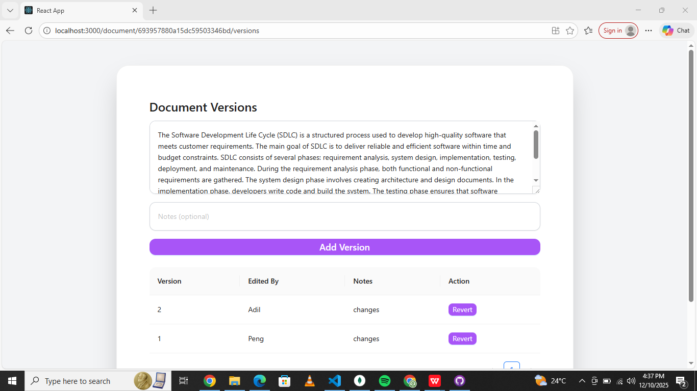
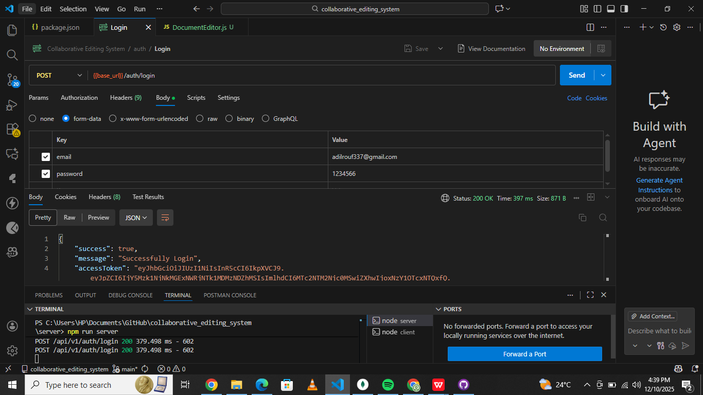

# 🌐 Collaborative Editing System

A professional **Real-Time Collaborative Document Editing System** built with MERN stack + Socket.io. Multiple users can edit documents at the same time with full version history, authentication, and a modern user interface.

---

## 📸 Screenshots

### 🔐 Login Page


### 📝 My Documents Page


### 🕒 Version History Page


### 🔌 Login API



## ⭐ Features

### 🔐 Authentication
- Login & Register using JWT  
- User Management 
- Secure API routes with middleware  

### ⚡ Real-Time Collaboration
- Multi-user live editing  
- Socket.io based real-time sync  
- Auto-updated content for all clients  

### 🕒 Version Control System
- Automatic version creation  
- Restore previous versions any time  
- Notes/comments for each version  

### 📄 Document Management
- Create document  
- Edit document  
- View document version history  

### 🎨 UI Features
- React.js + Ant Design components  
- Attractive animations with Framer Motion  
- Fully responsive modern layout  

---

## 🛠 Tech Stack

### Frontend
- React.js  
- Ant Design  
- Axios  
- Framer Motion  

### Backend
- Node.js  
- Express.js  
- Socket.io  
- MongoDB + Mongoose  
- JWT Authentication  

### Tools
- Postman  
- VS Code  
- Git & GitHub  

---

---

## ▶️ How to Run the Project

### 1️⃣ Backend (Server Side)
- cd server
- npm run server

### 2️⃣ Frontend (Server Side)
- cd client
- npm start

### Backend Tests
- **Auth API Tests**: signup, login, refresh token  
- **Document API Tests**: create, fetch, update, list documents  
- **Version API Tests**: add version, get version list, revert version  
- **Testing Tools**: Jest, Supertest, mongodb-memory-server  

_Run tests in server directory:_
```bash
cd server
npm test
